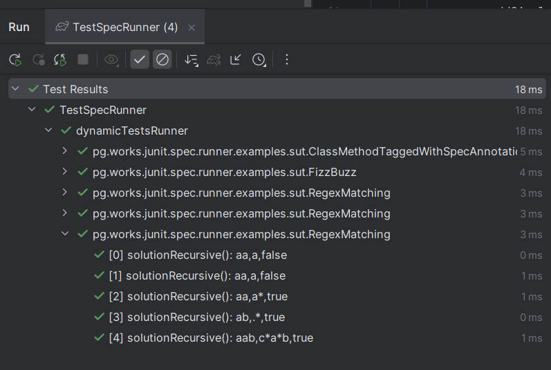

## Dynamic Junit Spec Runner
This project simplifies the creation of junit jupiter tests dynamically by specifying the test spec in a simple JSON format.

## Sample Test Runner
https://github.com/pgullah/junit-spec-runner/blob/c4a45fb201bb9b6a95d80614d0f9d029cc09947c/src/test/java/io/github/pgullah/jsr/examples/TestSpecRunner.java#L12-L26

