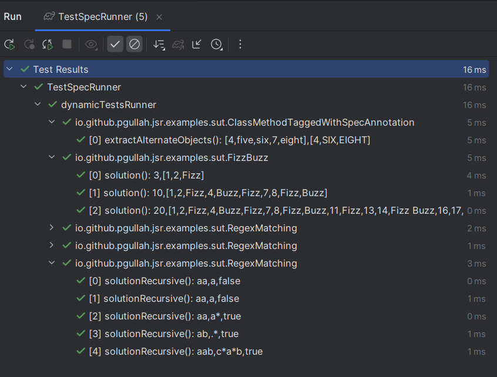

## Dynamic Junit Spec Runner
This project simplifies the creation of junit jupiter tests dynamically by specifying the test spec in a simple JSON format.

## Sample Test Runner
https://github.com/pgullah/junit-spec-runner/blob/85dcbd3932b96a18ff7c6ee6ea7c2689c1ab9e85/src/test/java/pg/works/junit/spec/runner/examples/TestSpecRunner.java#L9-L19

